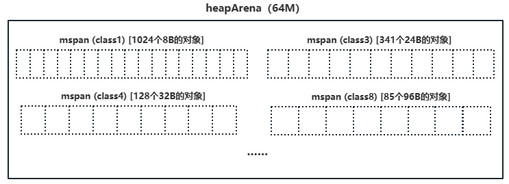

# 垃圾回收（Garbage Collection）

---

初步的概念：

> 1. golang的垃圾回收是针对堆的
> 2. 栈（stack）：由操作系统自动分配释放，发生逃逸时会到堆内存中
> 3. 堆（heap）：在golang中有自动的垃圾回收机制，在c/c++中则由程序员分配释放

## 栈内存（协程栈、调用栈）

> 堆上的栈，Go的协程栈位于堆内存上

### 作用


```
用户的main方法首先会开辟一个main.main的栈帧

每个协程第一个栈帧为 goexit()，每次调用其他函数会插入一个栈帧

栈帧首先记录栈基址（就是指从哪个方法调用进来的）方便返回的时候知道返回地址在哪
开辟调用方法的返回值，return就是将返回值写回上一个栈帧预留的空间
```

- 协程的执行路径（do1() → do2()）
- 局部变量（方法内部声明的变量会记录在协程栈中）
- 函数传参（方法间的参数传递，例如do2()需要一个入参，do1()是通过栈内存把参数传递给do2()）
- 函数返回值（do2()有返回值给do1()，用的也是栈内存传递）

### 位置

- Go协程栈位于Go堆内存上（Go的特殊设计，C++，C#的栈区和堆区是分开的）
  - 通过GC来释放
- Go堆内存位于操作系统虚拟内存上（操作系统会给每个进程分配一块虚拟内存）

### 结构

```shell
# -m 进行内存分配分析
# -l 避免程序内联
# -S 打印汇编调用信息
go run -gcflags="-m" stack_0.go
```

```go
package main

func sum(a, b int) int {
  s := 0
  s = a + b
  return s
}

func main()  {
  a := 3
  b := 5
  print(sum(a, b))
}
```


> 往后就是清理sum函数返回值、sum函数参数...，再给print开栈帧

### 总结

- 协程栈记录了协程的执行现场
- 协程栈还负责记录局部变量，传递参数和返回值
- Go使用参数拷贝传递（值传递）
  - sum函数传参的时候回开辟2个新的空间，将5、3拷贝进去
  - 推荐在代码中的结构体参数使用指针（节约内存）
    - 传递结构体时：会拷贝结构体中的全部内容
    - 传递结构体指针时：会拷贝结构体指针

### 思考

> 栈初始大小2~4k

- 协程栈不够大怎么办？
  - 局部变量太大
  - 栈帧太多

---

## 逃逸分析（从栈逃逸到堆上）

- 不是所有的变量都能放在协程栈上
- 栈帧回收后，需要继续使用的变量
- 太大的变量

### 指针逃逸

> 函数返回了对象的指针

```go
package main

func a() *int {
    v := 0  // .\stack_0_1.go:4:2: moved to heap: v
	// 若回收a()的所有栈帧回收，此处就会变为空指针，所以变量v不能放到栈上，而是放在堆上
    return &v
}

func main() {
    i := a() // 返回的是变量v的指针
    print(i)
}
```

```shell
go run -gcflags="-m" stack_0_1.go
```

### 空接口逃逸

> 如果函数的参数为 interface{}，函数的实参很可能会逃逸
> 因为 interface{} 类型的函数往往会使用反射（reflect对象要求是在堆上），未使用反射则不会逃逸

```go
package main

import "fmt"

func b() {
  i := 0 // 因为下面的 fmt.Println() 接收的是 interface{}，i会逃逸到堆上
  fmt.Println(i) // .\stack_1.go:7:13: i escapes to heap  （变量i逃逸到堆）
  // func Println(a ...interface{}) (n int, err error) {...}
}

func main() {
  b()
}
```

```shell
go run -gcflags="-m" stack_0_2.go
```

### 大变量逃逸

- 过大的变量会导致栈空间不足
- 64位机器中，一般超过64KB的变量会逃逸

### 栈扩容

> 栈空间是从堆中申请的，可以多申请

- Go 栈的初始空间为2KB
- 在函数调用前判断栈空间（morestack），必要时堆栈进行扩容
- 早期使用分段栈，后期使用连续栈

#### 分段栈

> 1.13之前使用
>
> 优点：没有空间浪费
>
> 缺点：栈指针会在不连续的空间跳转（影响性能）


#### 连续栈

> 1.14之后
>
> 优点：空间一直连续
>
> 缺点：伸缩时的开销大
>
> 当空间不足时扩容，变为原来的2倍（老的栈空间不足时，会找一块2倍大的栈空间并拷贝过去）
>
> 当空间使用率不足1/4时缩容，变为原来的1/2


./src/runtime/stubs.go:312 （使用汇编实现）

```go
func morestack() // 以64位为例：./src/runtime/asm_amd64.s
func morestack_noctxt()
```

## 堆内存

### 操作系统虚拟内存

- × 不是win的“虚拟内存”（内存不够的时候拿硬盘做虚拟内存）
- √ 操作系统给应用提供的虚拟内存空间
  - 系统会给每个进程一个虚拟的内存空间，而不是直接的物理内存，操作系统管理这些虚拟内存空间映射到物理内存空间
  - 背后是物理内存，也有可能有磁盘
- Linux获取虚拟内存：mmap、madvice

#### Linux（64位）

> 若虚拟内存超过物理内存(64GB)就是内存溢出（OOM），操作系统会杀掉进程


#### heapArena

- 在64位操作系统中(win除外) Go 每次申请的虚拟内存单元为64MB（以heapArena为单元申请，一次64MB，释放也是一次64MB）
- 最多有4,194,304个虚拟内存单元（2^20，刚好可以占满256TB）
- 所有的heapArena组成了mheap（Go堆内存）
- 当heapArena空间不足时，向操作系统申请新的heapArena


> go heap 会按照arena的大小增长，每次预留arena大小整数倍的虚拟地址空间。arena的大小与平台相关，除了windows，其他系统64位的平台下arena的大小都是64M。在32位的平台中，为了使go heap比较连续，没有碎片，当程序启动的时候就会先预留一大块虚拟地址空间，如果这些空间都被用完了，才会每次按照arena大小整数倍去预留虚拟地址空间。

```
       Platform  Addr bits  Arena size  L1 entries   L2 entries
 --------------  ---------  ----------  ----------  -----------
       */64-bit         48        64MB           1    4M (32MB)
 windows/64-bit         48         4MB          64    1M  (8MB)
       */32-bit         32         4MB           1  1024  (4KB)
     */mips(le)         31         4MB           1   512  (2KB)
```

./src/runtime/mheap.go:229

```go
// 62行，mheap
type mheap struct { // 这个就是golang的堆内存
    // ...
    // ↓ ↓ ↓ ↓ 157行 ↓ ↓ ↓ ↓
    arenas [1 << arenaL1Bits]*[1 << arenaL2Bits]*heapArena // 记录向操作系统申请的所有内存单元
    // ...
}

// 229行，这个结构体描述了一个64MB的内存单元（不是一个结构体64MB），记录向操作系统申请64MB虚拟内存的信息
// bitmap、pageMarks、pageSpecials都与GC有关
type heapArena struct {
    bitmap [heapArenaBitmapBytes]byte // 用于记录这个arena中有哪些位置有指针
    spans [pagesPerArena]*mspan  // 内存管理单元
    pageInUse [pagesPerArena / 8]uint8
    pageMarks [pagesPerArena / 8]uint8
    pageSpecials [pagesPerArena / 8]uint8
    checkmarks *checkmarksMap
    zeroedBase uintptr
}
```

#### 内存管理单元

##### 分级分配思想

为了减少每个对象（值）会放入可容纳该对象的最小的区域内


##### mspan

``上面所述的“级”就是 “内存管理单元 mspan”``



- 根据隔离适应策略，使用内存时的最小单位为mspan
- 每个mspan为N个大小相同的“格子”
- Go中一共有67种mspan，根据需求创建不同级别的mspan

> class 0 比较特别，没有固定大小
> 源码详情：./src/runtime/sizeclasses.go

```
   级别    对象大小  格子的大小   对象数  页面尾部浪费   最大浪费
 class  bytes/obj  bytes/span  objects  tail waste  max waste
     1          8        8192     1024           0     87.50%
     2         16        8192      512           0     43.75%
     3         24        8192      341           0     46.88%
    ...
    10        128        8192       64           0     11.72%
    11        144        8192       56         128     11.82%
    ...
    37       1792       16384        9         256     15.57%
    38       2048        8192        4           0     12.45%
    39       2304       16384        7         256     12.46%
    ...
    66      28672       57344        2           0      4.91%
    67      32768       32768        1           0     12.50%
```

> 因为mspan管理内存的最小单位是页面，而页面的大小不一定是size class大小的倍数，这会导致一些内存被浪费
>
> 例如下图中一个mspan划分成若干个slot用于分配，但是mspan占用页面的大小不能被slot的大小整除，所以有一个tail waste


> mspan：./src/runtime/mheap.go:384

```go
// 很明显是一个链表
type mspan struct {
  next *mspan // next span in list, or nil if none
  prev *mspan // previous span in list, or nil if none
  list *mSpanList // For debugging. TODO: Remove.
}
```

``每个heapArena中的mspan都不确定，如何快速找到所需的mspan级别？``

#### 中心索引 mcentral

- 136个mcentral结构体
  - 68个组需要GC扫描的mspan（堆中的对象）
  - 68个组不需要GC扫描的mspan（常量）
- mcentral 就是个链表头，保存了同样级别的所有mspan


##### 代码

> ./src/runtime/mheap.go:207

```go
type mheap struct {
    // ...
    // ↓ ↓ ↓ ↓ 207行 ↓ ↓ ↓ ↓
    central [numSpanClasses]struct { // numSpanClasses = 68 << 1 = 136
        mcentral mcentral
        pad      [cpu.CacheLinePadSize - unsafe.Sizeof(mcentral{})%cpu.CacheLinePadSize]byte
    }
    // ...
}
```

> ./src/runtime/mcentral.go:20

```go
type mcentral struct {
    spanclass spanClass // uint8 隔离级别
    partial [2]spanSet // 空闲的   A spanSet is a set of *mspans.
    full    [2]spanSet // 已满的
}
```

##### mcentral的性能问题

- mcentral 实际是中心索引，使用互斥锁保护
  - mcentral.go:119的cacheSpan()方法里调用了tryAcquire(s)方法，底层是通过atomic加锁实现
  - 在高并并发场景下，锁竞争问题严重


#### 线程缓存 mcache

> 参考协程GMP模型（P的本地队列），增加线程本地缓存
- 
- 不需要全局的协程列表获取线程，在本地就可以获取
- 线程缓存mcache
  - 每个P拥有一个mcache
  - 一个mcache拥有136个mspan
    - mcentral中每种（级别、GC扫描类型）span取一个组成mcache分配给线程
    - 68个需要GC扫描的mspan
    - 68个不需要GC扫描的mspan
    - 满了则会和中心索引进行交换


> ./src/runtime/runtime2.go:614行可以看到P中的mcache

```go
type p struct {
    // ...
    mcache      *mcache // 在线程执行的时候需分配内存（变量、常量等）就直接往这里写，写满后会进行全局交换
    // ...
}
```

> ./src/runtime/mcache.go:44 可以看到mcache中有136个span

```go
type mcache struct {
  nextSample uintptr
  scanAlloc  uintptr
  tiny       uintptr
  tinyoffset uintptr
  tinyAllocs uintptr
  alloc [numSpanClasses]*mspan  // numSpanClasses = 68 << 1 = 136
  stackcache [_NumStackOrders]stackfreelist
  flushGen uint32
}
```

#### 总结

- Go模仿TCmalloc，建立了自己的堆内存架构（c++用的,google开发go的时候直接拿过来了）
- 使用heapArena向操作系统申请内存
- 使用heapArena时，以mspan为单位（有一堆），防止碎片化
- mcentral是mspan们的中心索引（不用遍历heapArena，遍历mcentral即可，都分好类了，但是会有锁的并发问题）
- mcache记录了分配给每个P的本地mspan

### 堆内存分配

#### 对象级别

> 微、小对象分配至普通 mspan（class 1~67）
> 大对象量身定制 mspan （class 0 无固定大小）

- Tiny微对象 (0,16B) 无指针
- Small小对象 \[16B,32KB]
- Large 大对象 (32KB,+∞)

#### 微对象分配

> 从mcache拿到2级mspan，将多个微对象合并成一个16Bytes存入（class2 是由512个16B的对象组成）


---

##### 代码

> ./src/runtime/malloc.go:903

``可以推论 class 1 的 span 在当前Go版本用不到``

```go
func mallocgc(size uintptr, typ *_type, needzero bool) unsafe.Pointer {
    // ...
    // ↓ ↓ ↓ ↓ ↓ 991行 ↓ ↓ ↓ ↓ ↓
    if size <= maxSmallSize { // 先判断是否是微、小对象（小于32KB）
        if noscan && size < maxTinySize { // 判断是否是微对象（小于16B）
            // 注释1001行注释说明是组合成一个16B (bytes)
            off := c.tinyoffset
            if size&7 == 0 {
                off = alignUp(off, 8)
            } else if sys.PtrSize == 4 && size == 12 {
                off = alignUp(off, 8)
            } else if size&3 == 0 {
                off = alignUp(off, 4)
            } else if size&1 == 0 {
                off = alignUp(off, 2)
            }
            if off+size <= maxTinySize && c.tiny != 0 {
                x = unsafe.Pointer(c.tiny + off)
                c.tinyoffset = off + size
                c.tinyAllocs++
                mp.mallocing = 0
                releasem(mp)
                return x
            }
            span = c.alloc[tinySpanClass] // 这里拿的是 class 2 的 span
            v := nextFreeFast(span)
            if v == 0 {
                v, span, shouldhelpgc = c.nextFree(tinySpanClass)
            }
            x = unsafe.Pointer(v)
            (*[2]uint64)(x)[0] = 0
            (*[2]uint64)(x)[1] = 0
            if !raceenabled && (size < c.tinyoffset || c.tiny == 0) {
                c.tiny = uintptr(x)
                c.tinyoffset = size
            }
            size = maxTinySize
        } else { // 这里是小对象（16B~32KB）
            var sizeclass uint8
            // 通过查表确定使用几级的span
            if size <= smallSizeMax-8 {
                sizeclass = size_to_class8[divRoundUp(size, smallSizeDiv)]
            } else {
                sizeclass = size_to_class128[divRoundUp(size-smallSizeMax, largeSizeDiv)]
            }
            size = uintptr(class_to_size[sizeclass])
            spc := makeSpanClass(sizeclass, noscan)
            span = c.alloc[spc]
            v := nextFreeFast(span) // 找到没被占用的span中的小格子（obj）
            if v == 0 {
                v, span, shouldhelpgc = c.nextFree(spc) // 若没找到，则进行mcache替换
            }
            x = unsafe.Pointer(v)
            if needzero && span.needzero != 0 {
                memclrNoHeapPointers(unsafe.Pointer(v), size)
            }
        }
    } else {
        shouldhelpgc = true
        span, isZeroed = c.allocLarge(size, needzero && !noscan, noscan)
        span.freeindex = 1
        span.allocCount = 1
        x = unsafe.Pointer(span.base())
        size = span.elemsize
    }
    // ...
}
```

---

> ./src/runtime/malloc.go:876

```go
func (c *mcache) nextFree(spc spanClass) (v gclinkptr, s *mspan, shouldhelpgc bool) {
    s = c.alloc[spc]
    shouldhelpgc = false
    freeIndex := s.nextFreeIndex()
    if freeIndex == s.nelems {
        // The span is full.
        if uintptr(s.allocCount) != s.nelems {
            println("runtime: s.allocCount=", s.allocCount, "s.nelems=", s.nelems)
            throw("s.allocCount != s.nelems && freeIndex == s.nelems")
        }
        c.refill(spc) // 在这里进行mcache替换
        shouldhelpgc = true
        s = c.alloc[spc]

        freeIndex = s.nextFreeIndex()
    }

    if freeIndex >= s.nelems {
        throw("freeIndex is not valid")
    }

    v = gclinkptr(freeIndex*s.elemsize + s.base())
    s.allocCount++
    if uintptr(s.allocCount) > s.nelems {
        println("s.allocCount=", s.allocCount, "s.nelems=", s.nelems)
        throw("s.allocCount > s.nelems")
    }
    return
}
```

---

> ./src/runtime/mcache.go:146

```go
func (c *mcache) refill(spc spanClass) {
    s := c.alloc[spc]
    if uintptr(s.allocCount) != s.nelems {
        throw("refill of span with free space remaining")
    }
    if s != &emptymspan {
    // Mark this span as no longer cached.
        if s.sweepgen != mheap_.sweepgen+3 {
            throw("bad sweepgen in refill")
        }
        mheap_.central[spc].mcentral.uncacheSpan(s) // 卸载mcache
    }
    // Get a new cached span from the central lists.
    s = mheap_.central[spc].mcentral.cacheSpan() // 从中心索引装载mcache
    if s == nil {
        throw("out of memory")
    }
    // ...
}
```

##### mchache的替换

- mcache中，每个级别的mspan（根据隔离级别表格，有不同的对象(格子)数）只有一个
- 当mspan满了之后，会中mcentral中换一个新的
- 若mcentral中所有的span都满了，会进行扩容
  - mcentral中，只有有限数量的mspan
  - 当mspan缺少时，会从虚拟内存中申请更多(最多2^20)的heapArena（64MB）开辟新的mspan

#### 大对象分配

- 直接从heapArena开辟0级mspan
- 0级的mspan为大对象定制（可大可小）
  - 67级最大的格子大小是32KB，

##### 代码

> ./src/runtime/malloc.go:903

```go
func mallocgc(size uintptr, typ *_type, needzero bool) unsafe.Pointer {
    // ...
    if size <= maxSmallSize {
        // ...
        // ↓ ↓ ↓ ↓ ↓ 1065行 ↓ ↓ ↓ ↓ ↓
    } else { // 这里是大对象
        shouldhelpgc = true
        span, isZeroed = c.allocLarge(size, needzero && !noscan, noscan) // 在这里定制
        span.freeindex = 1
        span.allocCount = 1
        x = unsafe.Pointer(span.base())
        size = span.elemsize
    }
    // ...
}
```

#### 总结

- Go将对象分为3种，微(0,16B)、小\[16B,32KB]、大(32KB,+∞)
- 微、小对象使用mcache
  - mcache中的mspan装满后，与mcentral交换新的mcache（这里才有中心索引的锁竞争）
  - mcentral不足时，在heapArena开辟新的mspan
- 大对象直接在heapArena开辟新的mspan

## 垃圾回收（GC）

### 常见的几种算GC法

#### 标记-清除（golang使用的方式）

> 会有碎片的问题，但是golang使用了分级策略，所以影响不大


#### 标记-整理

> 改善碎片化，但GC开销大，会导致卡顿


#### 复制

> 会将当前有用的内存复制到新的区域中，再把旧的存储空间清理，该方法会导致内存浪费，但解决了碎片化的问题


### golang GC

- 因为Go堆内存结构的独特优势（分级span），选择最简单的“标记-清除”算法
- 找到有引用的对象，剩下的就是没有引用的

#### Root Set（GC Root）

##### 被栈上的指针引用

> 间接、直接使用都会生效

```go
package main

type company struct {
	name string
	address string
	boss *people
}

type people struct {
	name string
}

func main()  {
  p := &company{} # 这个 &company 被 变量p 引用，不会被清除，其中的 boss 是 *people，也不会被清除
  print(p)
}
```

##### 被全局变量指针引用

> const 定义的变量不会被清除

##### 被寄存器中的指针引用（CPU正在操作的指针）

> CPU 正在操作的变量，不会被清除

#### 串行GC步骤（v1.3及之前，v1.4加入写屏障）

- Stop The World， 暂停所有其他协程(性能影响大，STW的时间长短直接影响应用的执行)
- 通过可达性分析，找到无用的堆内存
- 释放堆内存
- 恢复所有其他协程

##### 可达性分析标记法

> Root 节点进行广度优先算法（BFS）搜索,这种方法也叫可达性分析标记法


#### 并发GC（v1.5及之后 三色并发标记清除进行垃圾回收）

> 并发的难点在于标记阶段

##### 三色标记法

- 黑色：有用，已经分析扫描
- 灰色：有用，还未分析扫描
- 白色：暂时无用，最后需要清除的对象

1. 把所有的对象标记为白色

   
2. 把程序根结点集合RootSet里的对象标记为灰色

   
3. 遍历标记为灰色的对象，找到关联的对象并标记为灰色，同时把自己标记为黑色

   
4. 重复此步骤，直到只剩下 黑色 和 白色

   

##### Yuasa 删除屏障（解决并发删除）

> 并发标记时，对指针释放的白色对象置灰

##### Dijkstra 插入屏障（解决并发插入）

> 并发标记时，对指针新指向的白色对象置灰

#### GC历程


### 优化GC效率

#### GC出发的时机

##### 系统定时触发

- sysmon 定时检查（Runtime 在启动程序的时候,会创建一个独立的M作为监控线程,称为sysmon,它是一个系统级的daemon线程）
- 如果2分钟内没有过GC，触发
- 谨慎调整（时间过长一次性需要处理的对象较多，导致卡顿）

> ./src/runtime/proc.go:5125

```go
var forcegcperiod int64 = 2 * 60 * 1e9 // 强制GC周期
```

##### 用户显式触发

- 调用 runtime.GC 方法
- 不推荐调用（不确定时机是否合适）

##### 申请内存时触发

- 给对象申请堆空间时，可能导致GC（mallocgc方法）

#### GC优化原则

##### 尽量少在堆上产生垃圾

###### 内存池化

> 参考channel环线缓存

- 缓存性质的对象
- 频繁创建和删除
- 使用内存池，不GC

###### 减少逃逸

> 参考前面的逃逸分析章节

- 逃逸会使原本在栈上的对象进入堆中
- 反射可能会导致逃逸（json、fmt包，取决于内容大小）
- 方法返回了指针而不是拷贝

###### 使用空结构体

- 空结构体指向一个固定地址
- 没有长度不占用内存空间
- 比如channel传递空结构体

  ```go
  // 不关心内容，只需要传递信号
  ch := make(chan struct{})

  ch <- struct{}{}
  ```
- 比如map不需要值的时候用hashSet，而不是hashMap

  ```go
  // HashSet
  demo1 := make(map[string]struct{}) // 这里只关心键，一般用于判断键是否唯一

  // HashMap
  demo2 := make(map[string]string) // key → value 的常规用法
  ```

##### GC分析工具

- go tool pprof
- go tool trace
- go build -gcflags="-m"
  - GODEBUG="gctrace=1" （简单粗暴）
    - 1.设置环境变量

      - windows
        ```shell
        $env:GODEBUG="gctrace=1"
        ```
      - linux/unix
        ```shell
        export GODEBUG="gctrace=1"
        ```
    - 2.运行程序

      ```shell
      go run gc.go
      ```
    - 3.查看控制台打印的GC情况

      ```
      gc 1 @0.010s 2%: 0+1.7+0 ms clock, 0+1.1/1.1/2.2+0 ms cpu, 4->5->5 MB, 4 MB goal, 0 MB stacks, 0 MB globals, 8 P
      gc 2 @0.013s 3%: 0+2.1+0 ms clock, 0+0/2.6/2.6+0 ms cpu, 14->14->14 MB, 11 MB goal, 0 MB stacks, 0 MB globals, 8 P
      ```

      - gc 1                  第1次GC
      - @0.013s               程序启动到GC标记完成的时间
      - 3%                    程序从启动到现在，GC标记工作的CPU使用占比（不超过10%）
      - 0+2.1+0 ms clock      0表示mark阶段的STW时间（单P的）；2.1表示并发标记用的时间（所有P的）；0表示标记完成阶段的STW时间（单P的）
      - 0+0/2.6/2.6+0 ms cpu
      - 14->14->14 MB         GC 开始、过程、结束的内存变化
      - 11 MB goal            表示下一次触发GC的内存占用阀值是11MB
      - 0 MB stacks
      - 0 MB globals
      - 8 P                   GMP模型中的P，线程数

#### 总结

- GC主要由系统定时触发或者生气内存触发
- GC优化的原则是减少在堆上产生垃圾
- 使用GC分析根据可以帮助分析GC问题
