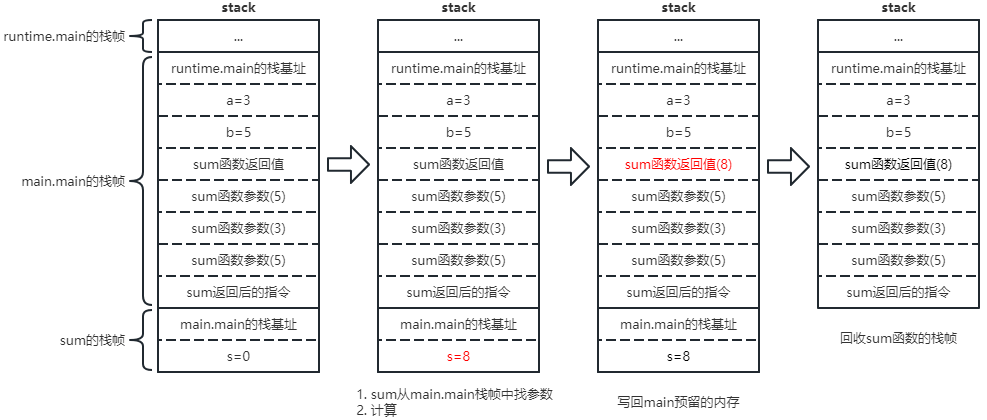

# 垃圾回收（Garbage Collection）

---

## 栈内存（协程栈、调用栈）

``堆上的栈，Go的协程栈位于堆内存上（）``
``go build -gcflags -S main.go``

### 作用


```
每个协程第一个栈帧为 goexit()

每次调用其他函数会插入一个栈帧

用户的main方法首先会开辟一个main.main的栈帧

栈帧首先记录栈基址（就是指从哪个方法调用进来的）方便返回的时候知道返回地址在哪
开辟调用方法的返回值，return就是将返回值写回上一个栈帧预留的空间
```

- 协程的执行路径（do1() → do2()）
- 局部变量（方法内部声明的变量会记录在协程栈中）
- 函数传参（方法间的参数传递，例如do2()需要一个入参，do1()是通过栈内存把参数传递给do2()）
- 函数返回值（do2()有返回值给do1()，用的也是栈内存传递）

- 栈内存（协程栈、调用栈）
- 堆内存
- 垃圾回收


### 位置

- Go协程栈位于Go堆内存上（Go的特殊设计，C++，C#的栈区和堆区是分开的）
  - 通过GC来释放
- Go堆内存位于操作系统虚拟内存上（操作系统会给每个进程分配一块虚拟内存）


### 结构

```go
package main

func sum(a, b int) int {
  s := 0
  s = a + b
  return s
}

func main()  {
  a := 3
  b := 5
  print(sum(a, b))
}
```



``往后就是清理sum函数返回值、sum函数参数...，再给print开栈帧``

### 总结

- 协程栈记录了协程的执行现场
- 协程栈还负责记录局部变量，传递参数和返回值
- Go使用参数拷贝传递（值传递）
  - sum函数传参的时候回开辟2个新的空间，将5、3拷贝进去
  - 推荐在代码中的结构体参数使用指针（节约内存）
    - 传递结构体时：会拷贝结构体中的全部内容
    - 传递结构体指针时：会拷贝结构体指针


## 堆内存

## 垃圾回收（GC）
