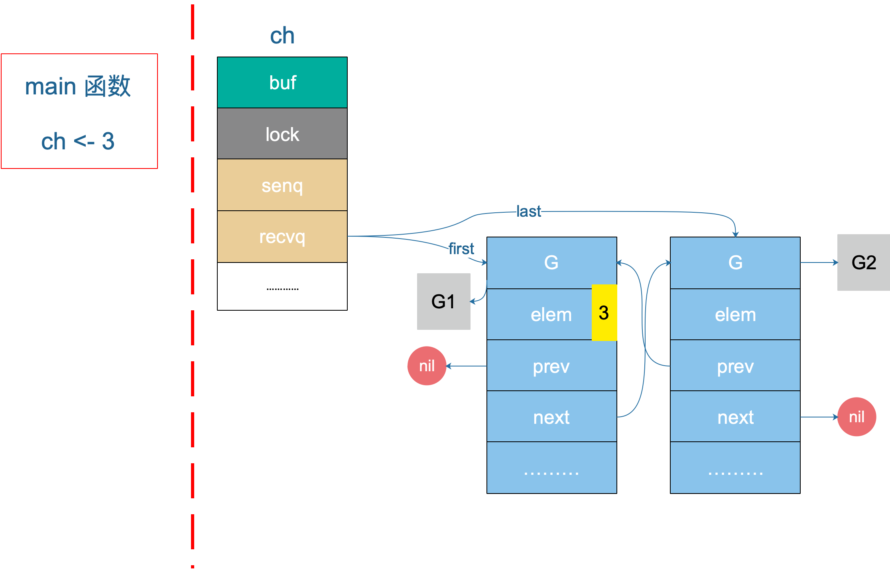

# Channel 管道

---

## 0.使用

```go
// 创建一个channel
ch := make(chan string) // 无缓存
ch := make(chan string, 0) // 无缓存
ch := make(chan string, 5) // 有缓存

ch <- "send data" // 发送数据

val := <-ch // 接收数据，赋给val

<-ch      // 接收数据，并丢弃
```

### 错误用法

fatal error: all goroutines are asleep - deadlock!

```go
package main

func main() {
    // ch := make(chan string)
    ch := make(chan string, 0) // 无缓存区

    //go func() { // 需要有协程在等待，否则会报错
    //    println(<-ch)
    //}()
    ch <- "ping" // 发送数据

    println(<-ch)
}
```

### 正确用法

无缓存区

```go
package main

func main() {
    ch := make(chan string, 0)

    go func() {
        println(<-ch)
    }()

    ch <- "send data"
}
```

有缓存区

```go
package main

func main() {
    ch := make(chan string, 5)

    ch <- "send data" // 发送数据

    println(<-ch)
}
```

## 1.Channel理念

#### 内存与通信

“不要通过共享内存的方式进行通信，而是应该通过通信的方式来共享内存”

#### 共享内存示例

```go
package main

import "time"

func watch(p *int) {
    for true { // 占用CPU
        if *p == 1 { // 若在同一时刻将p设置为1又设置为0时，则无法进入，若加锁又会带来性能的问题
            println("hello")
            break
        }
    }
}

func main() {
    i := 0
    go watch(&i)

    time.Sleep(time.Second)
    i = 1
    time.Sleep(time.Second)
}

```

#### 管道示例

```go
package main

import "time"

func watch(c chan int) {
    if <-c == 1 { // 管道本身是一直通信的模型，会阻塞休眠，不需要死循环
        println("hello")
    }
}

func main() {
    c := make(chan int)
    go watch(c)

    time.Sleep(time.Second)

    c <- 1

    time.Sleep(time.Second)
}
```

#### 为什么使用通信来共享内存？

- 避免协程竞争和数据冲突
- 更高级的抽象，降低开发难度，增加程序可读性
- 模块直接更容易解耦，增强扩展性和可维护性

## 2.Channel结构


### hchan

\src\runtime\chan.go

```go
// 核心数据结构
type hchan struct {
    // 前几个数据结构组成了缓存区 （Ring Buffer）
    qcount   uint // total data in the queue
    dataqsiz uint // size of the circular queue
    buf      unsafe.Pointer // points to an array of dataqsiz elements
    elemsize uint16
    closed   uint32 // 状态值 0-开启 1-关闭
    elemtype *_type // element type

    // 后几个数据结构负责收发数据
    sendx    uint  // 发送链表的游标，指向发送链表中的第几个协程
    recvx    uint  // 接收链表的游标
    recvq    waitq // 接收链表
    sendq    waitq // 发送链表

    // lock 保护了hchan中的所有字段
    lock mutex
}

type waitq struct {
    first *sudog // sudog 协程的包装
    last  *sudog
}

```

### closed 状态值

* 0为开启
* 1为关闭

### 缓存区

- 环形缓存可以大幅度降低GC的开销（队列新增数据需要开辟内存，队尾删除数据需要回收内存，垃圾回收压力较大）


### 接收、发送队列

##### 接收队列

存放想接收数据但没有数据可接收的协程（当缓存区无数据且无协程发送数据时，接收的协程进入该队列休眠）


```go
recvx    uint
recvq    waitq
```

发送队列

存放想发送数据但没有数据可发送的协程（当无缓存区、缓存区满时，发送数据的协程进入该队列休眠）


```go
sendx    uint
sendq    waitq
```

### lock mutex 互斥锁

- 互斥锁并不是排队发送/接收数据（排队是由接收/发送队列负责）
- 互斥锁保护的hchan结构体本身
- Channel并不是无锁的

``如果多个协程都往缓存区塞数据的话，加锁后会互相等待，按顺序写入缓存区，保证channel并发的正确性``

## 3.Channel底层原理

### 数据发送

#### c<- 关键字

* c<- 关键字是一个语法糖
* 编译阶段，会把 c<- 转化为 runtime.chansend1()
* chansend1() 会调用 chansend() 方法

```go
// 142 行
func chansend1(c *hchan, elem unsafe.Pointer) {
    chansend(c, elem, true, getcallerpc())
}
```

#### 1）直接发送

##### ① 原理

- 发送数据前，已经有G在休眠等待接收（至少有一个goroutine）
- 缓存为空，不用考虑缓存
- 将数据直接复制给G的接收变量，唤醒G
  

##### ② 实现

- 从队列里取出一个等待接收的G
- 将数据直接复制到接收变量中
- 唤醒G

###### chansend

```go
// 158 行
// c channel核心结构体
// ep unsafe包的万能指针，表示发送的数据指针，例如 ch<-"demo" 中的字符串的指针
// block 是否允许阻塞，chansend1中为true
// callerpc 
func chansend(c *hchan, ep unsafe.Pointer, block bool, callerpc uintptr) bool {
    if c == nil { // 如果 channel 是nil
        if !block { // 不能阻塞，直接返回false，表示未发送
            return false
        }
            gopark(nil, nil, waitReasonChanSendNilChan, traceEvGoStop, 2) // 当前goroutine被挂起
            throw("unreachable")
    }
    // ↑ ↑ ↑ ↑ 165 行 ↑ ↑ ↑ ↑ 
    // --- 此处省略debug代码、注释 ---
    // ↓ ↓ ↓ ↓ 200 行 ↓ ↓ ↓ ↓ 
    lock(&c.lock) // hchan结构体中的mutex，对成员的变更保护, 并发安全

    if c.closed != 0 { // 判断channel是否关闭
        unlock(&c.lock) // hchan.mutex解锁
        panic(plainError("send on closed channel"))
    }

    // 从接收的等待队列中取出一个goroutine，然后判断是否为nil（判断是否有goroutine在等待）
    if sg := c.recvq.dequeue(); sg != nil {
        send(c, sg, ep, func () { unlock(&c.lock) }, 3) // 情形1：直接发送
        return true
    }

    // 省略后续代码（缓存型channel且还有缓存空间的情况）
    // ......
}

```

###### send

```go
// 这里的send函数是处理向一个空的channel发送操作
// c *hchan 管道的核心结构体
//    c缓存区为空，因为等待队列里有goroutine
//    c必须为上锁状态，，在发送操作完成后，会用 unlockf 函数解锁
// sg *sudog 等待的协程的包装
//    必须已经从等待队列里取出来了
//    sg.elem 例如 val := <-ch 指的是这个 val 变量的指针
// ep unsafe包的万能指针
//    指向被发送的元素，会直接拷贝到接收的goroutine，例如 ch <- "test"，则是这个 "test" 的指针
//    必须是非空，并且他指向堆或者调用者的栈
func send(c *hchan, sg *sudog, ep unsafe.Pointer, unlockf func(), skip int) {
    // 忽略golang竞态检测相关代码，raceenabled 默认为 false
    // ↓ ↓ ↓ 309行 ↓ ↓ ↓
    if sg.elem != nil { // 接收变量的指针是否为空
        sendDirect(c.elemtype, sg, ep) // 从发送者的内容直接拷贝到接收者的变量指针
        sg.elem = nil
    }
    // sudog 上绑定的 goroutine
    gp := sg.g
    // 外部传入的对channel的解锁方法
    unlockf()
    gp.param = unsafe.Pointer(sg)
    sg.success = true
    if sg.releasetime != 0 {
        sg.releasetime = cputicks()
    }
    // 唤醒接收的 groutine. skip 和打印栈相关，暂时不理会
    goready(gp, skip+1)
}
```

###### sendDirect

```go
// 向一个非缓存型、空缓存区的channel上发送
func sendDirect(t *_type, sg *sudog, src unsafe.Pointer) {
    // src 在当前gorotine 的栈上，dst 是另一个 goroutine 的栈

    // 直接进行内存“搬迁”
    // 如果目标地址的栈发生了栈收缩，当我们读出了 sg.elem 后，就不能修改真正的 dst 位置的值
    // 因此需要在读和写之前加上一个屏障
    // (可忽略，涉及golang的栈内存管理)
    dst := sg.elem // 接收的变量指针
    typeBitsBulkBarrier(t, uintptr(dst), uintptr(src), t.size) // 写屏障 
    memmove(dst, src, t.size) // 从 src 拷贝 t.size 个字节到 dst 中
}
```

###### sudog

```go
type sudog struct {
    // 协程
    g *g
    // sema中用这2个组成的平衡二叉树，在channel里则是用这个实现链表
    next *sudog
    prev *sudog
    // 万能指针，详情看源码注释，这里存的是接收变量的指针 val:= <-ch
    elem unsafe.Pointer

    acquiretime int64
    releasetime int64
    ticket      uint32
    isSelect bool
    success bool
    parent   *sudog // semaRoot binary tree
    waitlink *sudog // g.waiting list or semaRoot
    waittail *sudog // semaRoot
    c        *hchan // channel
}

```



#### 2）放入缓存

##### ① 原理

- 没有G在休眠等待，但是有缓存空间

- 将数据放入缓存
  

##### ② 实现

- 获取可存入的缓存地址

- 存入数据

- 维护索引

（不需要与其他的goroutine有交集）

###### chansend

```go
func chansend(c *hchan, ep unsafe.Pointer, block bool, callerpc uintptr) bool {
    // ......
    // ↑ ↑ ↑ ↑ 212行 ↑ ↑ ↑ ↑ 
    // --- 省略之前已读代码 ---
    // ↓ ↓ ↓ ↓ 214行 ↓ ↓ ↓ ↓
    if c.qcount < c.dataqsiz { // 判断channel的 缓存队列数量 小于 缓存区大小
        // Space is available in the channel buffer. Enqueue the element to send.
        qp := chanbuf(c, c.sendx) // 从缓存区拿出一个可用的缓存单元，指向缓存区的第c.sendx个槽的指针
        if raceenabled { // golang竞态检测
            racenotify(c, c.sendx, nil)
        }
        typedmemmove(c.elemtype, qp, ep) // 数据拷贝
        c.sendx++ // 维护索引
        if c.sendx == c.dataqsiz {
            c.sendx = 0
        }
        c.qcount++ // 维护索引
        unlock(&c.lock)
        return true
    }
    // --- 省略后续代码 ---
    // ......
}

```

#### 3）休眠等待

##### ① 原理

- 没有G在休眠等待，而且没有缓存区或者满了

- 自己进入发送队列，休眠等待
  
  

##### ② 实现

- 把自己包装成sudog

- sudog放入sendq队列

- 休眠并解锁channel

- 被唤醒后，数据已经被取走，维护其他数据

###### chansend

```go
func chansend(c *hchan, ep unsafe.Pointer, block bool, callerpc uintptr) bool {
    // ......
    // ↑ ↑ ↑ ↑ 234行 ↑ ↑ ↑ ↑ 
    // --- 省略之前已读代码 ---

    // 发送方阻塞
    gp := getg() // 获取当前goroutine的指针
    mysg := acquireSudog() // 获取一个sudog
    mysg.releasetime = 0
    if t0 != 0 {
        mysg.releasetime = -1
    }
    // No stack splits between assigning elem and enqueuing mysg
    // on gp.waiting where copystack can find it.
    mysg.elem = ep // 记录要发送的内容
    mysg.waitlink = nil
    mysg.g = gp   // 记录自己goroutine的指针
    mysg.isSelect = false
    mysg.c = c // 绑定channel
    gp.waiting = mysg
    gp.param = nil
    c.sendq.enqueue(mysg) // 将这个sudog入队到发送队列

    atomic.Store8(&gp.parkingOnChan, 1)
    // 休眠当前goroutine
    gopark(chanparkcommit, unsafe.Pointer(&c.lock), waitReasonChanSend, traceEvGoBlockSend, 2)
    KeepAlive(ep)

    // 从这里开始被唤醒了（channel可以发送了），后续都是对当前goroutine的数据维护，可忽略
    if mysg != gp.waiting {
            throw("G waiting list is corrupted")
    }
    gp.waiting = nil
    gp.activeStackChans = false
    closed := !mysg.success // sudog是否通信成功，这里表示channel是否关闭
    gp.param = nil
    if mysg.releasetime > 0 {
        blockevent(mysg.releasetime-t0, 2)
    }
    mysg.c = nil // 去掉sudg绑定的channel
    releaseSudog(mysg)
    if closed {
        if c.closed == 0 {
            throw("chansend: spurious wakeup")
        }
        panic(plainError("send on closed channel"))
    }
    return true
}

```

### 数据接收

#### <- c 关键字

- <- c 关键字是一个语法糖
- 编译阶段，i <- c 转化为 runtime.chanrecv1()
- 编译阶段，i , ok <- c 转化为 runtime.chanrecv2()
- 最后 会调用 chanrecv() 方法

```go
//go:nosplit
func chanrecv1(c *hchan, elem unsafe.Pointer) {
    chanrecv(c, elem, true)
}

//go:nosplit
func chanrecv2(c *hchan, elem unsafe.Pointer) (received bool) {
    _, received = chanrecv(c, elem, true)
    return
}
```

#### 1）有等待发送的G

##### ① 原理

- 接收数据前，已经有G在休眠等待发送

- 这个channel为非缓存型
  
  - 将数据直接从G拷贝过来，唤醒G

- 缓存型channel，且缓存区已满
  
  - 从缓存取走一个数据
  
  - 将休眠的G的数据放进缓存，唤醒G
  
  

##### ② 实现

- 判断有G在发送队列等待（非缓存型，或缓存区已满），进入recv()
- 判断此Channel无缓存
  - 直接从等待的G中取走数据，唤醒G
- 判断Channel有缓存
  - 从缓存中取走一个数据
  - 将G的数据放入缓存，唤醒G

###### chanrecv

```go
// c channel核心结构体
// ep unsafe包的万能指针，表示接收数据的变量指针，例如 x <-ch 中接收数据的变量x的指针
// block 是否允许阻塞，写死为true
func chanrecv(c *hchan, ep unsafe.Pointer, block bool) (selected, received bool) {
    // ......
    // --- 此处省略debug代码及非阻塞状态代码 ---
    // ↓ ↓ ↓ ↓ 503 行 ↓ ↓ ↓ ↓ 
    var t0 int64
    if blockprofilerate > 0 {
            t0 = cputicks()
    }

    lock(&c.lock) // 对channel加锁，并发安全

    // chhanel 已关闭，并且循环数组buf里有没有元素
    // 这里可以处理 非缓存型关闭 和 缓存型关闭但buf无元素的情况
    // 也就是说即使是关闭状态，但在缓存型的channel，buf里有元素的情况下还能接收到参数
    if c.closed != 0 && c.qcount == 0 { // channel已关闭，且缓存队列为空
            if raceenabled {
                raceacquire(c.raceaddr())
            }
            unlock(&c.lock) // 解锁
            if ep != nil {
                typedmemclr(c.elemtype, ep)
            }
        // 从一个已关闭的channel接收，selected 会返回 true，received 返回 false
            return true, false
    }

    // 等待发送队列里有goroutine存在
    // 说明：
    // 1. 非缓存型的channel（直接进行内存拷贝，从 sender goroutine -> receiver goroutine）
    // 2. 缓存型的chhanel，但buf满了（接收到寻更换数组头部的元素，并将发送者的元素放到循环数组尾部）
    if sg := c.sendq.dequeue(); sg != nil {
        // Found a waiting sender. If buffer is size 0, receive value
        // directly from sender. Otherwise, receive from head of queue
        // and add sender's value to the tail of the queue (both map to
        // the same buffer slot because the queue is full).
        recv(c, sg, ep, func() { unlock(&c.lock) }, 3)
        return true, true
    }

    // 省略后续代码
    // ......
}
```

###### recv

```go
func recv(c *hchan, sg *sudog, ep unsafe.Pointer, unlockf func(), skip int) {
    if c.dataqsiz == 0 { // 非缓存型channel
        if raceenabled { // 忽略，golang 竞态检测
            racesync(c, sg)
        }
        if ep != nil { // 接收数据的地址不为空
            // 拷贝数据 sender goroutine -> receiver goroutine
            recvDirect(c.elemtype, sg, ep)
        }
    } else {
        // 缓存型channel且缓存队列已满
        // 将缓存数组buf队首的元素拷贝到接收数据的地址
        // 将发送者的数据入队，这时revx和sendx值相等
        qp := chanbuf(c, c.recvx) // channel缓存区的第c.recvx个槽的指针
        if raceenabled { // 忽略，golang 竞态检测
            racenotify(c, c.recvx, nil)
            racenotify(c, c.recvx, sg)
        }
        // 将缓存区的数据拷贝给接收者
        if ep != nil {
            typedmemmove(c.elemtype, ep, qp)
        }
        // 将发送者数据拷贝到缓存区的当前槽位
        typedmemmove(c.elemtype, qp, sg.elem)
        c.recvx++ // 游标+1
        if c.recvx == c.dataqsiz { // 环形缓存区
            c.recvx = 0
        }
        c.sendx = c.recvx // c.sendx = (c.sendx+1) % c.dataqsiz
    }
    sg.elem = nil // 发送队列的数据置空
    gp := sg.g // 发送队列的sudog里的goroutine
    unlockf() // 解锁
    gp.param = unsafe.Pointer(sg)
    sg.success = true
    if sg.releasetime != 0 {
        sg.releasetime = cputicks()
    }
    goready(gp, skip+1) // 唤醒发送等待队列的队首的goroutine，需要等到调度器的调度
}
```

#### 2）接收缓存

##### ① 原理

- 没有G在休眠等待发送，但是缓存有内存

- 从缓存取走数据
  
  

##### ② 实现

- 判断没有G在发送队列等待
- 判断此Channel有缓存
- 从缓存中取走一个数据 

###### chanrecv

```go
func chanrecv(c *hchan, ep unsafe.Pointer, block bool) (selected, received bool) {
    // ......
    // --- 此处省略已读代码 ---
    // ↓ ↓ ↓ ↓ 530 行 ↓ ↓ ↓ ↓ 
    if c.qcount > 0 { // 缓存型，缓存区里有数据
        // Receive directly from queue
        qp := chanbuf(c, c.recvx) // 用接收游标取缓存区里的数据指针
        if raceenabled { // 忽略，golang 竞态检测
            racenotify(c, c.recvx, nil)
        }
        if ep != nil { // 接收数据的指针不为空
            typedmemmove(c.elemtype, ep, qp) // 将从缓存区取出的数据复制
        }
        typedmemclr(c.elemtype, qp) // 清理掉已取数据的缓存区槽位的值
        c.recvx++ // 接收游标向前移动
        if c.recvx == c.dataqsiz {
            c.recvx = 0
        }
        c.qcount-- // 缓存区内的数据的数量减一
        unlock(&c.lock)
        return true, true
    }


    // 省略后续代码
    // ......
}
```

#### 3）阻塞接收

##### ① 原理

- 没有G在休眠等待，而且没有缓存或缓存空

- 自己进入接收队列，休眠等待（对应直接发送）
  

##### ② 实现

- 判断没有G在发送队列等待
- 判断此Channel无缓存
- 将自己包装成sudog
- sudog放入接收等待队列，休眠
- 唤醒时，发送的G已经把数据拷贝到位（参考 直接发送）

###### chanrecv

```go
func chanrecv(c *hchan, ep unsafe.Pointer, block bool) (selected, received bool) {
    // ......
    // --- 此处省略已读代码 ---
    // ↓ ↓ ↓ ↓ 530 行 ↓ ↓ ↓ ↓ 

    // 无可用的发送方，阻塞（和sender阻塞类似）
    gp := getg() // 获取当前goroutine指针
    mysg := acquireSudog() // 构建一个sudog
    mysg.releasetime = 0
    if t0 != 0 {
        mysg.releasetime = -1
    }
    // No stack splits between assigning elem and enqueuing mysg
    // on gp.waiting where copystack can find it.
    mysg.elem = ep // 待接收数据的地址
    mysg.waitlink = nil
    gp.waiting = mysg
    mysg.g = gp
    mysg.isSelect = false
    mysg.c = c
    gp.param = nil
    c.recvq.enqueue(mysg) // 进入接收的等待队列
    // Signal to anyone trying to shrink our stack that we're about
    // to park on a channel. The window between when this G's status
    // changes and when we set gp.activeStackChans is not safe for
    // stack shrinking.
    atomic.Store8(&gp.parkingOnChan, 1)
    // 休眠当前goroutine
    gopark(chanparkcommit, unsafe.Pointer(&c.lock), waitReasonChanReceive, traceEvGoBlockRecv, 2)

    // 此时已被唤醒，维护数据的状态
    if mysg != gp.waiting {
        throw("G waiting list is corrupted")
    }
    gp.waiting = nil
    gp.activeStackChans = false
    if mysg.releasetime > 0 {
        blockevent(mysg.releasetime-t0, 2)
    }
    success := mysg.success
    gp.param = nil
    mysg.c = nil
    releaseSudog(mysg)
    return true, success
}
```

## 4.Channel用法补充

### Select （非阻塞channel）

#### ① Demo

执行结果为“none”，未因为channel而阻塞后续代码的运行

```go
package main

import (
    "fmt"
)

func main() {
    c1 := make(chan int, 5)
    c2 := make(chan int)
    select {
    case <-c1:    // c1 没有发送方，且缓存区为空，会阻塞
        fmt.Println("c1")
    case c2 <- 1: // c2 没有缓存区，会阻塞
        fmt.Println("c2")
    default:
        fmt.Println("none")
    }
}


```

#### ② 原理

- 同时存在接收、发送、默认路径

- 首先查看是否有可以即时执行的case

- 没有的话，有default，走default

- 没有default，把自己注册在所有的channel中，休眠等待（从c1的接收等待队列，c2的发送等待队列，然后休眠，谁先唤醒就先走哪个case）

### NewTimer

#### ① Demo

- timer可以提供一个channel，定时塞入数据

- time.NewTimer 和 time.Sleep 区别
  
  - 两者都会让当前的gorotine执行一段时间
  
  - time.Sleep() 会让当前goroutine进入sleep子状态，但仍保持运行，如果cancel调用后还处于sleep状态无法即使被取消
  
  - channel接收操作会让当前goroutine进入阻塞状态

```go
package main

import (
    "fmt"
    "time"
)

func main() {
    // 写法 1
    t := time.NewTimer(1 * time.Second)
    <-t.C // 阻塞 1秒
    fmt.Println("hello world")

    // 写法 2
    <-time.After(1 * time.Second) // 内部返回 time.NewTimer(d).C
    fmt.Println("hello world")
}


```
