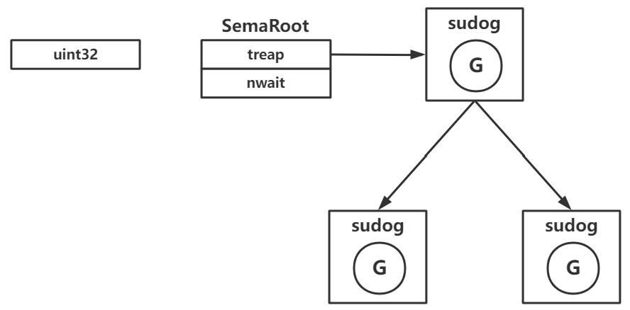

(golang 1.17)

# 一、互斥锁

---

## 1. atomic

atomic包是golang中执行原子操作的包

### 协程同时操作一个变量

运行以下的代码，结果大概率不符合预期，c ≠ 1000

```go
func add(p *int32) {
    *p = *p + 1
}

func main() {
    c := int32(0)
    for i := 0; i < 1000; i++ {
        go add(&c)
    }
    time.Sleep(5 * time.Second)
    println(c)
}
```

将 add() 方法调整，就会得到预期的结果：

```go
func add(p *int32) {
    atomic.AddInt32(p, 1)
}
```

### 源码解读

\src\sync\atomic\doc.go 源码中可以看到文件中只有函数的申明，并没有详细的代码，说明这个方法可能是汇编实现的

```go
func AddInt32(addr *int32, delta int32) (new int32)
```

这时候就要进行以下步骤进一步查看：

1. 进一步查看源码就需要 ctrl+shift+f 在go目录下全局搜索 AddInt32 并限制后缀名为“.s”

2. 这时候点击 \src\runtime\internal\atomic\atomic_amd.s 文件中看到 Addint32() 这个方法是由 Xaddint32() 实现的（mac
   m1之类arm架构的处理器编译的可以看atomic_arm.s，实现是大同小异）
   
   ```plan9_x86
   TEXT ·Xaddint32(SB), NOSPLIT, $0-20
       JMP    ·Xadd(SB)
   ```

3. 可以看到 Xaddint32() 中调用了 Xadd() 方法，在同文件的 87行
   可以看到该方法，这个方法是纯汇编实现，其中可以看到91行的关键字“LOCK”，这个CPU级别的内存锁（Go的原子锁是CPU内部给内存地址上了一个LOCK指令）
   
   ```plan9_x86
   TEXT ·Xadd(SB), NOSPLIT, $0-20
   MOVQ    ptr+0(FP), BX
   MOVL    delta+8(FP), AX
   MOVL    AX, CX
   LOCK
   XADDL    AX, 0(BX)
   ADDL    CX, AX
   MOVL    AX, ret+16(FP)
   RET
   ```

### 总结

1. 原子操作是一种硬件层面加锁的机制
2. 保证操作一个变量的时候，其他协程/线程无法访问
3. 只能用于简单变量的简单方法

---

## 2. sema 锁 (Semaphore)

- 也叫信号量锁/信号锁
  - 大小为1的信号量相当于互斥锁（go中的sync.Mutex）
  - 大小为n(n>0)的信号量可以实现限流的功能（go中的sync.WaitGroup）
- 核心是一个uint32值，含义是同时可并发的数量
- 每一个sema锁都对于一个SemaRoot结构体
- SemaRoot中有一个平衡二叉树用于协程排队

### 源码

1. 在go的sync下绝大部分都使用了sema锁，以 \src\sync\mutex.go 为例（25行），可以看到Mutex结构体中的字段sema是uint32（在RWMutex中是xxxSem，大同小异）
   
   ```go
   type Mutex struct {
       state int32
       sema  uint32
   }
   ```

2. 每个sema字段的uint32都对应了 \src\runtime\sema.go 中的 semaRoot 结构体（40行）
   
   ```go
   type semaRoot struct {
       lock  mutex
       treap *sudog // 平衡二叉树的根节点
       nwait uint32 // 协程等待数 Number of waiters. Read w/o the lock.
   }
   ```
   
   - sudog struct（协程的包装，在sema中用于平衡二叉树的根节点）
     
     ```go
     type sudog struct {
         g *g // 协程
         next *sudog
         prev *sudog
         elem unsafe.Pointer   
         acquiretime int64
         releasetime int64
         ticket      uint32
         isSelect bool
         success bool
         parent   *sudog // semaRoot binary tree
         waitlink *sudog // g.waiting list or semaRoot
         waittail *sudog // semaRoot
         c        *hchan // channel
     }
     ```

### sema锁 结构

- treap 指针指向一个sudog结构体
- 每个sudog内部都有一个指针指向一个协程，以此组成一个平衡二叉树
- sema锁的行为很大程度上取决于定义的uint32的值
  

#### sema 操作（uint32 > 0）

``图右边的那一堆在此场景下没用到``

- 获取锁：uint32减一，获取成功
  
  ```go
  func semacquire(addr *uint32) { // 94行
      semacquire1(addr, false, 0, 0)
  }
  
  func semacquire1(addr *uint32, lifo bool, profile semaProfileFlags, skipframes int) {  
      // 98行
      gp := getg()
      if gp != gp.m.curg {
          throw("semacquire not on the G stack")
      }
  
      // Easy case.
      if cansemacquire(addr) { // 这里传入的是表面上uint32数字的地址，uint32>0时return（105行）
          return
  }
  // ......此处省略后续代码，后续代码为 uint32==0 的情况......
  }
  ```
  
  cansemacquire() 方法中调用了atomic包，对addr操作
  
  ```go
  func cansemacquire(addr *uint32) bool {
      for {
          v := atomic.Load(addr)
          if v == 0 {
              return false
          }
          if atomic.Cas(addr, v, v-1) { // 比较与交换(Compare and swap)，若addr=v，则addr=v-1
              return true
          }
      }
  }
  ```

- 释放锁：uint32加一，释放成功
  
  ```go
  func semrelease(addr *uint32) { // addr对应的是uint32的地址【159行】
      semrelease1(addr, false, 0)
  }
  
  func semrelease1(addr *uint32, handoff bool, skipframes int) {
      root := semroot(addr)
      atomic.Xadd(addr, 1) // 1.对uint32数字加一
  
      if atomic.Load(&root.nwait) == 0 { // 2.如果没有协程在等待则return
          return
      }
  
      lockWithRank(&root.lock, lockRankRoot)
      if atomic.Load(&root.nwait) == 0 {
          unlock(&root.lock)
          return
      }
      s, t0 := root.dequeue(addr)
      if s != nil {
          atomic.Xadd(&root.nwait, -1)
      }
      unlock(&root.lock)
      if s != nil { // May be slow or even yield, so unlock first
          acquiretime := s.acquiretime
          if acquiretime != 0 {
              mutexevent(t0-acquiretime, 3+skipframes)
          }
          if s.ticket != 0 {
              throw("corrupted semaphore ticket")
          }
          if handoff && cansemacquire(addr) {
              s.ticket = 1
          }
          readyWithTime(s, 5+skipframes)
          if s.ticket == 1 && getg().m.locks == 0 {
              goyield()
          }
      }
  }
  ```

- 可以多个协程同时获得，若uint32=5，则有5个协程可以同时获得该锁（5 * -1），5个协程在用完并释放后，uint32的值恢复到初始值5

#### sema 操作（uint32 == 0）

``图右边的那一堆在此场景下才会使用``

- 获取锁：协程休眠，进入堆数等待
  
  ```go
  func semacquire1(addr *uint32, lifo bool, profile semaProfileFlags, skipframes int) {
      gp := getg()
      if gp != gp.m.curg {
          throw("semacquire not on the G stack")
      }
  
      // Easy case.
      if cansemacquire(addr) {
          return
      }
      // ------------------ 分界线 ------------------
      // ↓ ↓ ↓ ↓ ↓ 当uint32=0的时候走到以下代码 ↓ ↓ ↓ ↓ ↓
  
      // Harder case:
      //    increment waiter count
      //    try cansemacquire one more time, return if succeeded
      //    enqueue itself as a waiter
      //    sleep
      //    (waiter descriptor is dequeued by signaler)
      s := acquireSudog()  // 0.获得sudog结构体
      root := semroot(addr) // 1.获取uint32的地址对应的sema结构体
      t0 := int64(0)
      s.releasetime = 0
      s.acquiretime = 0
      s.ticket = 0
      if profile&semaBlockProfile != 0 && blockprofilerate > 0 {
          t0 = cputicks()
          s.releasetime = -1
      }
      if profile&semaMutexProfile != 0 && mutexprofilerate > 0 {
          if t0 == 0 {
              t0 = cputicks()
          }
          s.acquiretime = t0
      }
      for {
          lockWithRank(&root.lock, lockRankRoot)
          // Add ourselves to nwait to disable "easy case" in semrelease.
          atomic.Xadd(&root.nwait, 1)
          // Check cansemacquire to avoid missed wakeup.
          if cansemacquire(addr) {
              atomic.Xadd(&root.nwait, -1)
              unlock(&root.lock)
              break
          }
          // Any semrelease after the cansemacquire knows we're waiting
          // (we set nwait above), so go to sleep.
          root.queue(addr, s, lifo) // 2.将包含协程的sudug结构体放入semaRoot的treap平衡二叉树里排队，当成一个队列使用
          goparkunlock(&root.lock, waitReasonSemacquire, traceEvGoBlockSync, 4+skipframes) // 3.将当前的协程休眠
          if s.ticket != 0 || cansemacquire(addr) {
              break
          }
      }
      if s.releasetime > 0 {
          blockevent(s.releasetime-t0, 3+skipframes)
      }
      releaseSudog(s)
  }
  ```

- 释放锁：从堆中取出一个协程，唤醒
  
  semrelease1()
  
  ```go
  s, t0 := root.dequeue(addr) // 从gopark中将协程释放出来【178行】
  ```

- 减到0的时候，sema锁退化成一个专用的休眠队列
  
  1. 如果还有协程想要获取这个sema锁的时候，就会休眠进入semaRoot.treap的平衡二叉树中分配一个新的节点，将协程放入sudog的g中，再走到gopark进行休眠
  2. 当别的协程释放的时候（addr=0 + 1），会判断当前semaRoot.nwait再去从平衡二叉树中取出来一个协程释放，继续的调度

#### 总结

- sema锁是runtime的常用工具（外部无法调用）
- sema经常被用作休眠队列（经常把uint32配置成0）

#### 疑问

不太理解sema为什么用的是平衡二叉树，而不是用链表？？？

## 3. sync.Mutex

- Go 的互斥锁
- Go 中用户并发保护最常见方案
